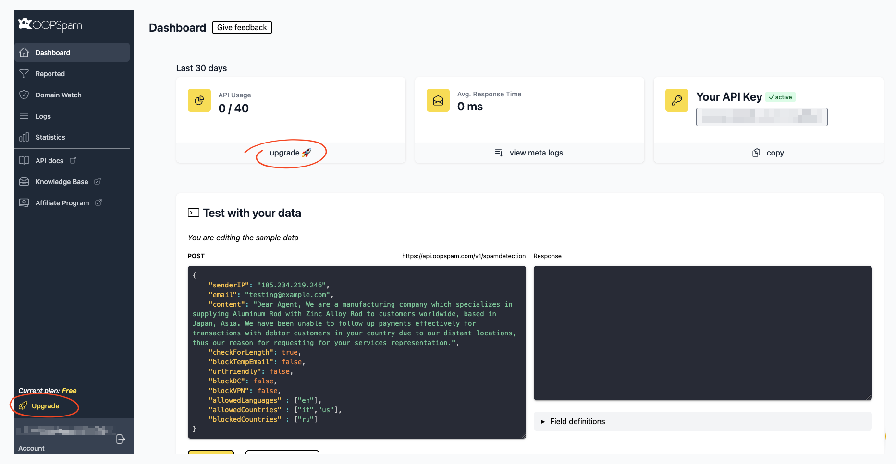
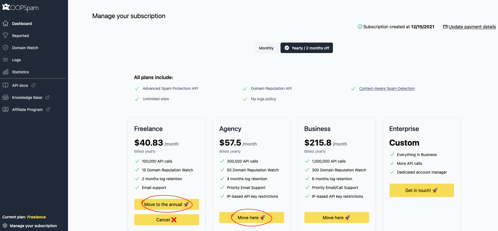
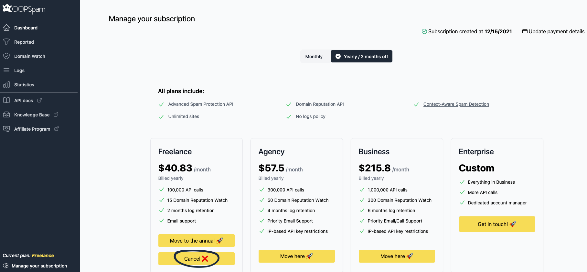
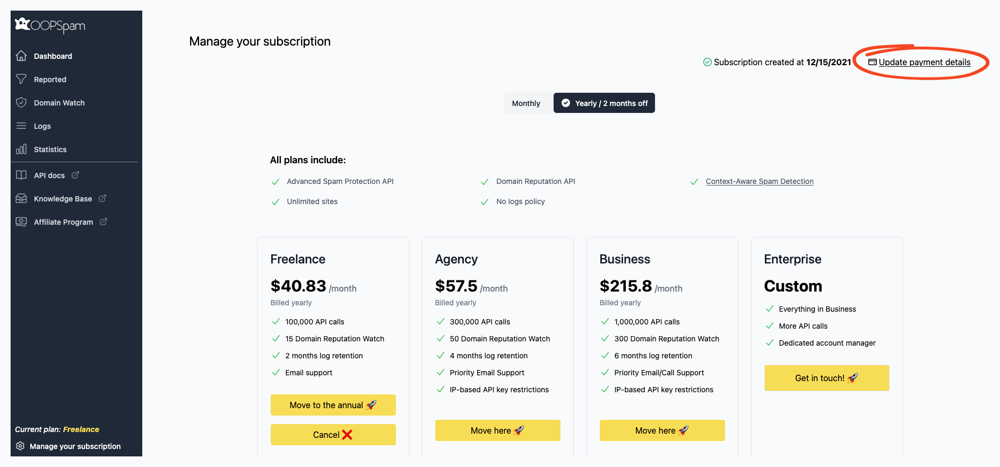
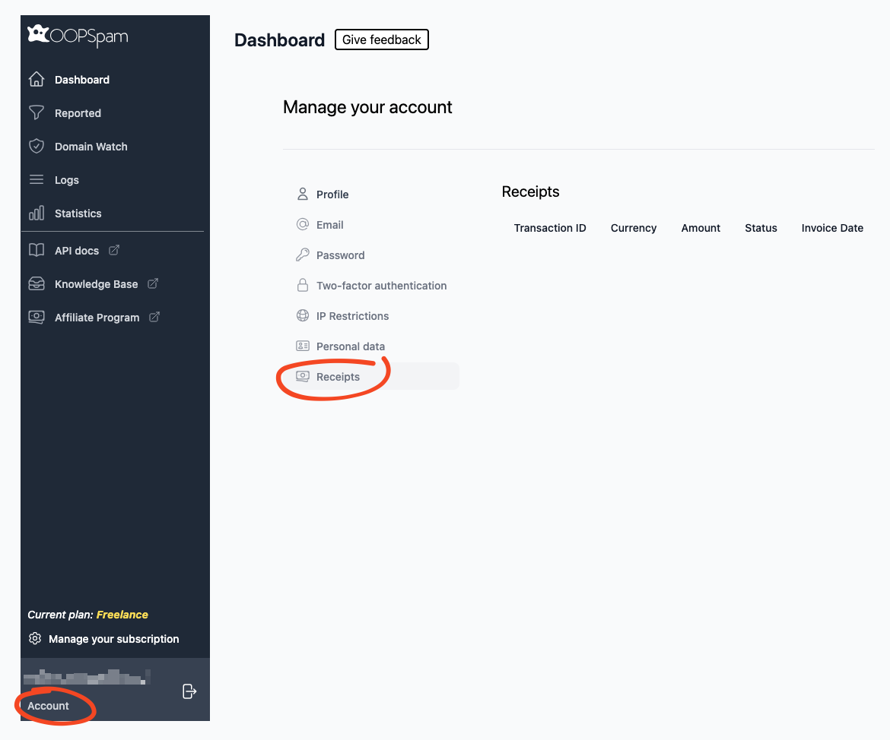

## How to upgrade or downgrade, cancel?

### Upgrading and downgrading

If you're using the Free plan, clicking any Upgrade link will redirect you to the pricing page on your dashboard. Simply select your desired plan, click the upgrade button, and enter your payment details. Your account will be upgraded within seconds.

For users on paid plans, locate the "Manage your subscription" link in your dashboard. This takes you to the subscription management page where you can switch plans by clicking the "Move here" button under your desired plan. This action will upgrade or downgrade your account depending on the selected plan.


You can switch to an Annual plan on this page for additional savings.


### Canceling

To cancel your subscription, navigate to the "Manage your subscription" page and click the Cancel button under your current plan.


🚨 **IMPORTANT** Upon cancellation, your account immediately reverts to the Free plan.


## How to update my billing information?

Navigate to the "Manage your subscription" page and click the "Update payment details" link to open the billing information window.


Keep your billing information current and ensure sufficient funds are available. After three failed payment attempts (with ~5 day intervals), the system will restrict your API key. We'll notify you via email after each attempt, giving you time to update your billing information. Access remains restricted until valid payment details are provided.


### Where are the invoices?

Access your receipts through the Account page. From the dashboard, navigate to Account → Receipts.

## Next

Dive right into the following section to get started:






