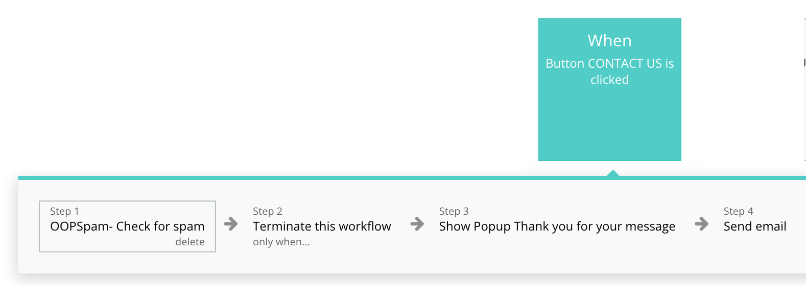

[OOPSpam Bubble plugin](https://bubble.io/plugin/oopspam-spam-detection-1582908608700x936823858020745200) can be used to block spam registration and contact form submissions.
Here is an example how you can use the plugin to stop spam on your Bubble contact forms.

Check out [How to set up OOPSpam with Bubble.io app](https://www.oopspam.com/blog/spam-protection-for-bubble.io) article for more information.