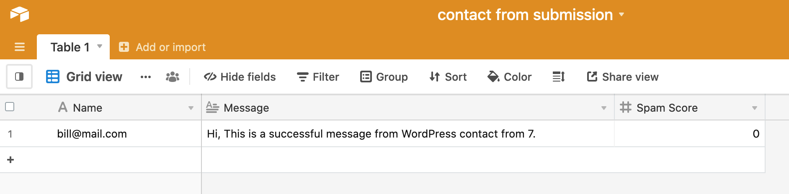

[Make](https://www.make.com/en?utm_source=oopspam&utm_medium=partner&utm_campaign=oopspam-partner-program) is a visual automation platform that lets you send information between OOPSpam API and thousands of apps with just a few clicks. All you have to do is drop [OOPSpam Make App](https://www.make.com/en/integrations/oopspam-anti-spam) to your scenario and enter API key.

Let's look at the following example.

On this scenario, we add and connect Contact Form 7, OOPSpam Anti-Spam and Airtable apps.

1. Contact Form 7 app receives form submissions and passes data to OOPSpam app.
2. OOPSpam analyzes and passes the spam score to the filter between OOPSpam and Airtable app.
3. Filter allows data to be passed to Airtable app only if the spam score is less than 3.
4. Airtable receives data and insert it to a spreadsheet.
5. ✅ Done!

Every contact form, comment, email and chat apps on Make can be connect in similar fashion.

To report false positives and false negatives, see [the reporting documentation](/report).

### Related blog posts:

- [Stop Spam on Elementor Forms Using Make and OOPSpam](https://www.oopspam.com/blog/elementor-form-make-spam)
- [Stop Spam on Breakdance Forms Using Make and OOPSpam](https://www.oopspam.com/blog/stop-spam-on-breakdance-forms-using-make-and-oopspam)

## Next

Dive right into the following section to get started:






