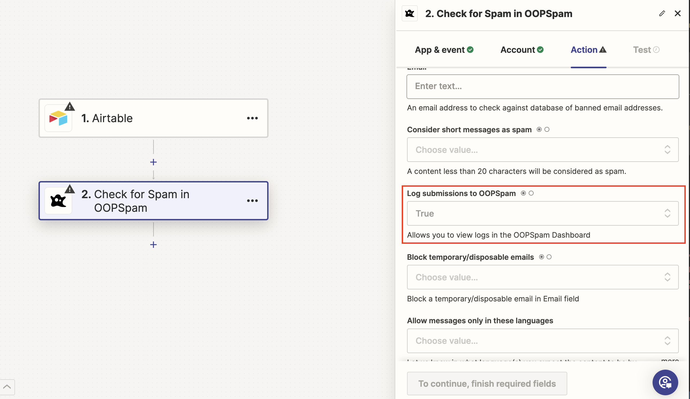
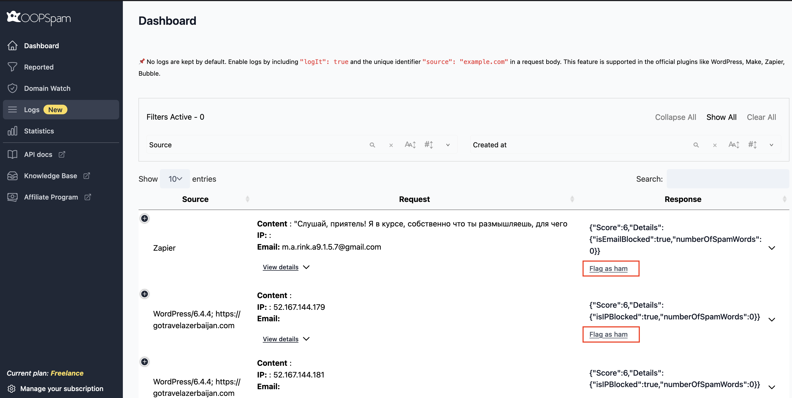

The oopspam API takes an optimistic approach and avoids blocking messages unless it's confident they are spam. However, false positives (legitimate messages marked as spam) and false negatives (spam messages marked as legitimate) can still occur.
There are various reasons for false positives and false negatives, such as:

- IP addresses previously used for spamming but now in different hands, retaining a bad reputation.
- Messages incorrectly flagged

To minimize these occurrences, it's essential to train the oopspam API's standard model with the specific spam and non-spam (ham) messages you're receiving. This process will improve the model's accuracy over time, reducing false positives and false negatives.

## Reporting False Positives and False Negatives

Depending on the plugin (or the API) you're using, there are several ways to report false positives and false negatives to the oopspam model:

### API

The API users, should use [the Report endpoint](https://www.oopspam.com/docs/#report) to report any false positives and false negatives. The status of the reported items can be viewed at [the Reported page](https://app.oopspam.com/ReportedSpam) in the oopspam Dashboard.


To report via the oopspam Dashboard, add the [`logIt`](https://www.oopspam.com/docs/#spam-detection) parameter in the request body to view and report requests on [the Logs page](/wordpress/form-entries/#logs-in-the-oopspam-dashboard).


### WordPress

Use [the Form Spam Entries and Form Valid Entries](/wordpress/form-entries/) tables to report false positives and false negatives.

### Zapier, Make.com, Bubble.io

1. Set the `Log submissions to oopspam` setting to `true`. For Bubble.io, set `logIt` to `true` in the request body.

    

2. This will enable you to view and report all submissions on [the Logs page](https://app.oopspam.com/Logs) in the oopspam dashboard. Click __Flag as spam__ or __Flag as ham__ to flag an entry as a false positive or false negative, respectively.

    

3. The flagged items will be available under [the Reported page](https://app.oopspam.com/ReportedSpam).

## Next

Dive right into the following section to get started:






