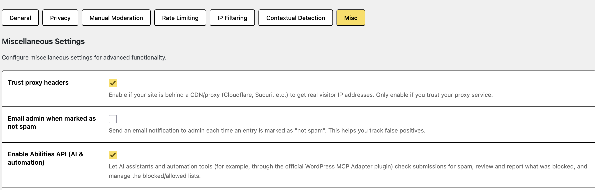
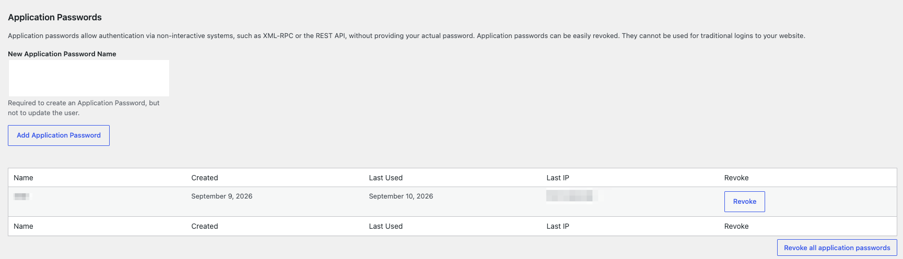
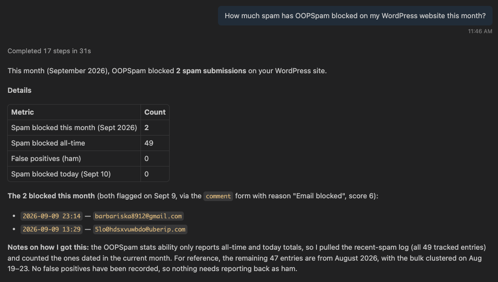
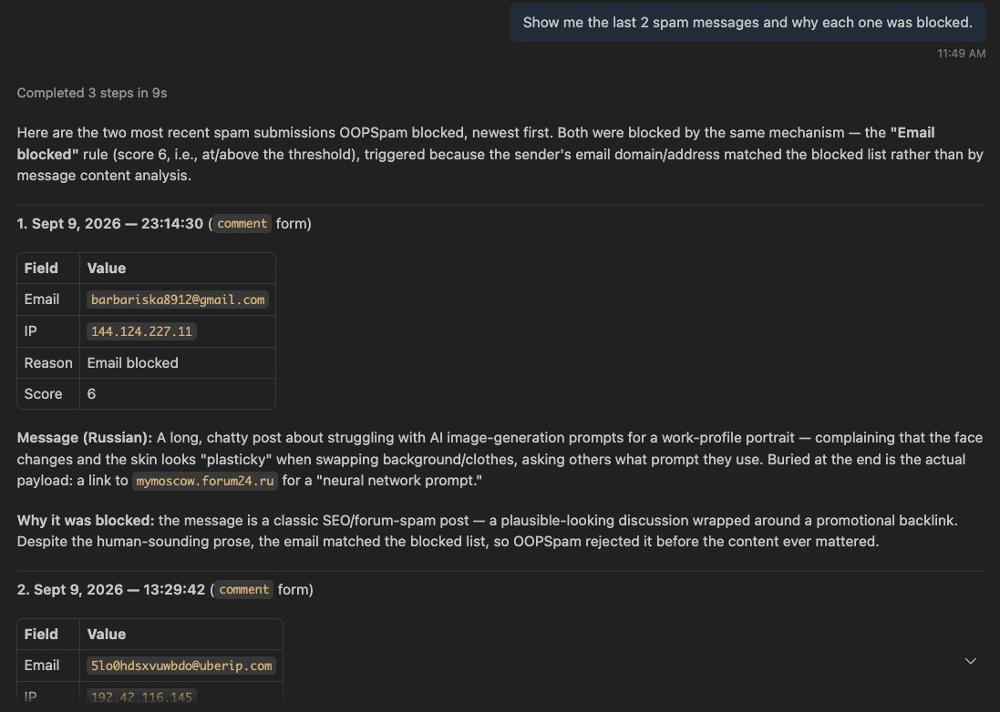

The OOPSpam WordPress plugin can connect to AI assistants and automation tools through WordPress's Abilities API. Once enabled, an assistant (for example, one connected through the official WordPress MCP Adapter plugin) can check submissions for spam, show you what was blocked and why, report mistakes back to OOPSpam, and manage your blocked and allowed lists for you.

No coding is required to benefit from this. You turn the feature on in the plugin settings, and from then on you can simply ask your assistant.

## Requirements

Before you start, make sure your site meets these requirements:

- **WordPress 6.9 or newer.** The Abilities API is only available in WordPress 6.9 and above. If your site is older, the setting has no effect until WordPress is updated.
- **OOPSpam plugin version 1.2.79 or newer** with a valid [API key configured](../configuration/#quick-set-up).
- **An assistant or tool that can talk to WordPress abilities**, such as the official [WordPress MCP Adapter plugin](https://github.com/WordPress/mcp-adapter), the WordPress REST API, or another plugin.


  The feature is off by default and only needs to be enabled once. Only users who can manage the site (WordPress administrators) can use it.


## How to enable it

1. Log in to your WordPress dashboard.
2. Go to **OOPSpam Anti-Spam -> Settings**.
3. Scroll down to the **Miscellaneous Settings** section.
4. Tick the **Enable Abilities API (AI & automation)** checkbox.
5. Click **Save Changes**.

Once saved, OOPSpam's abilities are registered and ready for your assistant to discover and use.


  If the checkbox says the feature requires WordPress 6.9 or newer, your site is not on a new enough version yet. Update WordPress first, then come back and enable the setting.


## Connect your AI tool

Enabling the setting makes OOPSpam's abilities available, but your AI tool still needs a way to sign in to your site. WordPress handles this with **Application Passwords**: a separate password created just for one tool or device. It is not your normal login password, and you can revoke it at any time without changing how you log in.

To create one:

1. In your WordPress dashboard, go to **Users -> Profile**.
2. Scroll down to the **Application Passwords** section.
3. Enter a name that identifies the tool, for example `Claude`.
4. Click **Add New Application Password**.
5. Copy the generated password immediately. WordPress only shows it once.

Next, when your AI tool asks how to connect to your site, enter:

- **Username**: your WordPress username, the name you log in with
- **Password**: the Application Password you just copied

You use the same pair of credentials for any AI tool or automation you connect, and you can create a separate Application Password for each one so they can be revoked independently.


  Do not use your regular WordPress account password. Always use the generated Application Password, which is designed to be shared with a tool and revoked later.



  Application Passwords are intended for HTTPS connections. On a live site, make sure your site uses HTTPS. Local development sites are usually exempt, so this works over plain HTTP when testing locally.


You can review when each password was last used, and revoke any of them, from the same **Application Passwords** section. If you ever think a password has been exposed, revoke it and create a new one.

## What an assistant can do

After enabling the Abilities API, you can ask your assistant to help with your spam protection in plain language. Here are a few examples of what it can do:

### See how much spam your site is getting

Ask questions like "How much spam has OOPSpam blocked on my website this month?" or "Show me my spam stats." The assistant can report how many spam and legitimate messages OOPSpam has caught, both today and in total.

### Review what was blocked and why

Ask "Show me the last few spam messages and why each one was blocked" or "What did OOPSpam block recently?" The assistant can list recent blocked submissions and explain the reason and spam score behind each one.

### Check a message before it goes out

Paste the content of a message, an email address, or an IP and ask "Is this spam?" The assistant checks it through the same OOPSpam detection pipeline used by your forms and tells you whether it looks like spam, with a score and reason.

### Report mistakes to improve accuracy

If a message was wrongly blocked, or spam got through, ask the assistant to report it. It sends feedback to OOPSpam so the service can learn from the mistake and get more accurate over time.

### Manage your blocked and allowed lists

Ask things like "Block the email address `spam@example.com`", "Allow this IP address", or "What is currently on my blocklist?" The assistant can add or remove entries from your manual moderation lists and show you what is on them.


  Everything an assistant can do is limited to OOPSpam spam protection. It cannot change your other site content, and it never sees your full API key, only a masked version.


## Available abilities

Under the hood, each of these actions is a registered "ability". The table below pairs the everyday action with its technical ability name, which is useful if you build automations or want to talk to the REST API directly.

| Ability | What it does |
| --- | --- |
| `oopspam/status` | Returns a health snapshot: whether OOPSpam is configured, the masked API key, spam score threshold, and which protections are active |
| `oopspam/check-submission` | Checks content, an IP, and an email through the full detection pipeline and returns whether it is spam, with a score and reason |
| `oopspam/get-stats` | Returns the number of spam and legitimate (ham) entries, all-time and today |
| `oopspam/list-recent-spam` | Returns the most recent blocked submissions, with the reason, score, email, IP, and form that triggered them |
| `oopspam/list-moderation-lists` | Returns the current blocked and allowed emails, IPs, and blocked keywords |
| `oopspam/report-submission` | Reports a submission to OOPSpam as spam or ham to improve detection accuracy |
| `oopspam/block-email` | Adds an email address (or a wildcard such as `*@example.com`) to the blocked list |
| `oopspam/unblock-email` | Removes an email address (or wildcard) from the blocked list |
| `oopspam/allow-email` | Adds an email address (or wildcard) to the allowed list so it is never flagged |
| `oopspam/unallow-email` | Removes an email address (or wildcard) from the allowed list |
| `oopspam/block-ip` | Adds an IP address, CIDR block, or IP range to the blocked list |
| `oopspam/unblock-ip` | Removes an IP address, CIDR block, or IP range from the blocked list |
| `oopspam/allow-ip` | Adds an IP address, CIDR block, or IP range to the allowed list |
| `oopspam/unallow-ip` | Removes an IP address, CIDR block, or IP range from the allowed list |

## For developers

For technical users building on top of this integration:

- OOPSpam registers its abilities under the `oopspam` category when the feature is enabled and the [WordPress Abilities API](https://developer.wordpress.org/apis/abilities-api/) is available (WordPress 6.9+).
- Abilities follow the `oopspam/name` pattern and expose JSON Schema for their inputs and outputs, so tools can discover and validate them automatically.
- By default, only users with the `manage_options` capability (administrators) can execute them.
- The plugin respects a `OOPSPAM_ENABLE_ABILITIES` constant defined in `wp-config.php` to force the feature on, and an `oopspam_are_abilities_enabled` filter to control it from code.
- When connecting over HTTP, clients authenticate with WordPress Basic Auth using the username and Application Password. The MCP Adapter's HTTP proxy accepts these as the `WP_API_USERNAME` and `WP_API_PASSWORD` settings.

See the [WordPress Abilities API documentation](https://developer.wordpress.org/apis/abilities-api/) to learn how abilities are registered and consumed.
