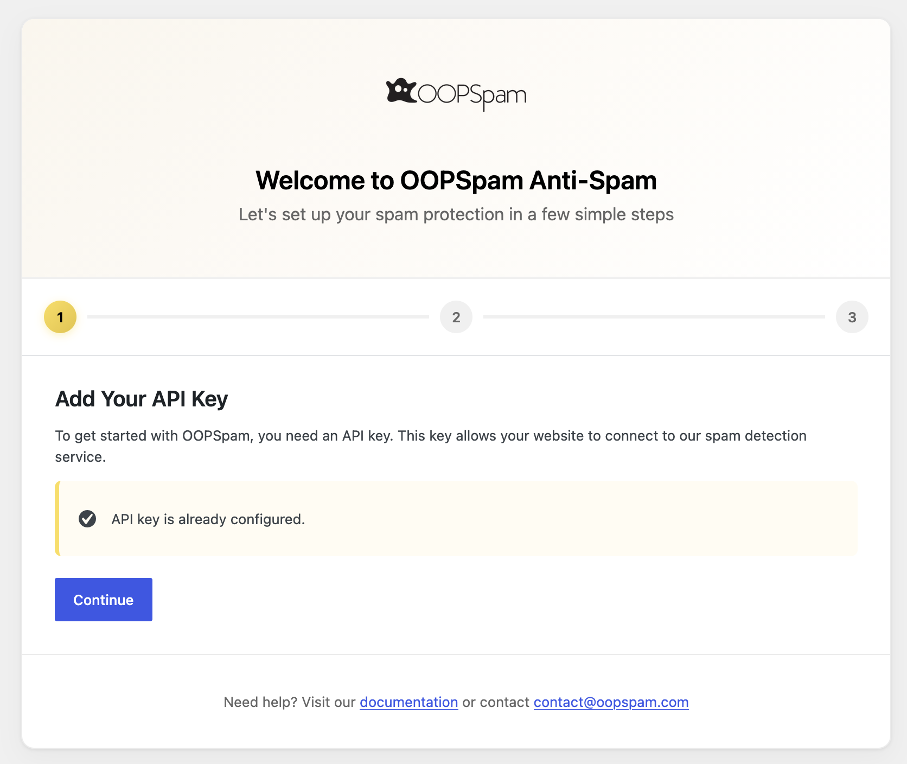
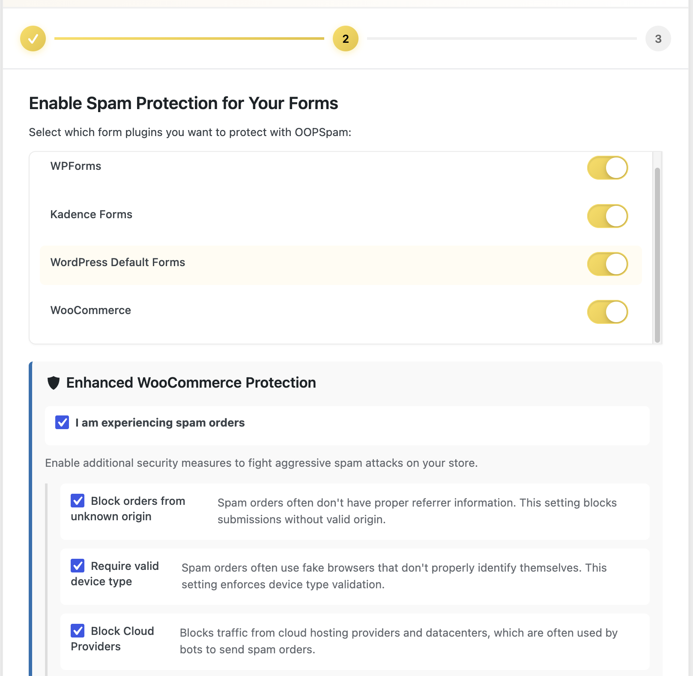
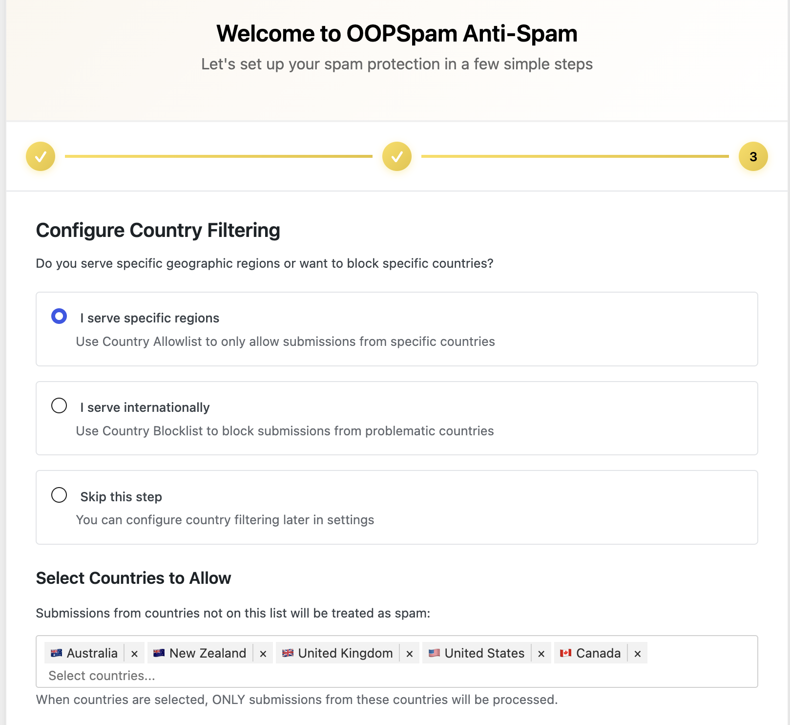

The OOPSpam Setup Wizard helps you configure the plugin quickly after installation. It walks you through the essential steps to get spam protection running on your site.

## When the Wizard Appears

The setup wizard automatically opens when:

- You activate the plugin for the **first time** (no API key configured)
- You haven't completed the setup wizard yet

If you already have an API key configured, the wizard marks itself as complete and won't redirect you.


You can always access the Setup Wizard from the OOPSpam menu: **OOPSpam Anti-Spam → ↺ Setup Wizard**


---

## Step 1: API Key

Enter your OOPSpam API key to connect the plugin to the spam detection service.

- If you don't have an API key yet, click the link to create a free account on the OOPSpam Dashboard
- If you already have an API key, it will be pre-filled
- Choose your API key source: **OOPSpam Dashboard** (default) or **RapidAPI**

---

## Step 2: Form Protection

The wizard automatically detects which form builder plugins you have installed and lets you toggle spam protection on or off for each one.

Supported integrations that are auto-detected include:

- Contact Form 7
- WPForms
- Ninja Forms
- Gravity Forms
- Fluent Forms
- Elementor Forms
- Formidable Forms
- Bricks Forms
- Breakdance Forms
- WS Form
- WPDiscuz
- Kadence Forms
- Piotnet Forms
- Toolset Forms
- HappyForms
- GiveWP
- WordPress Default Forms
- BuddyPress
- WooCommerce
- Forminator
- Beaver Builder
- Ultimate Member
- MemberPress
- Jetpack Forms
- Mailchimp for WordPress (MC4WP)
- Newsletters by Tribulant
- MailPoet
- Quform
- SureCart
- SureForms
- Avada Forms

### Enhanced WooCommerce Protection

If WooCommerce is detected, you will see an additional section with a checkbox labeled **"I am experiencing spam orders"**. When enabled, it reveals additional anti-fraud settings:

- **Block orders from unknown origin**: Blocks orders without proper referrer information
- **Require valid device type**: Blocks orders from fake browsers that do not properly identify themselves
- **Block Cloud Providers**: Blocks traffic from cloud hosting providers and datacenters, which are often used by bots to send spam orders
- **Extra Screening**: Applies additional checks for stricter spam filtering on the OOPSpam API side

---

## Step 3: Country Filtering

Configure which countries can submit forms on your site:

- **Country Allowlist**: Only accept submissions from selected countries
- **Country Blocklist**: Reject submissions from selected countries
- **Skip**: Don't configure country filtering right now

You can always adjust these settings later under **OOPSpam Anti-Spam → Settings**.

---

## After the Wizard

Once you complete the wizard, the plugin is fully configured and protecting your forms. You can fine-tune settings anytime:

- Adjust **sensitivity level** and **privacy settings**
- Set up **rate limiting**
- Configure **manual moderation** block/allow lists
- Review **form entries** for false positives/negatives

---

## Next






