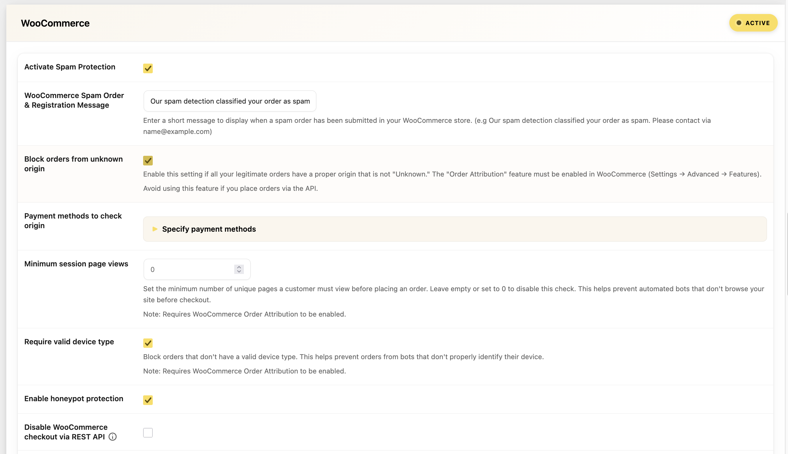
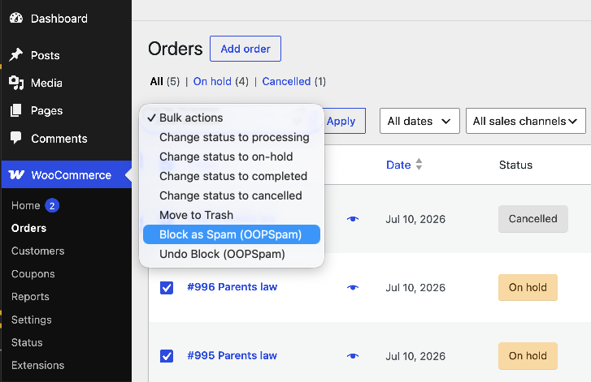

The OOPSpam plugin provides deep WooCommerce integration that goes beyond basic spam detection. In addition to protecting registration, login, and checkout forms with the OOPSpam API, it includes a comprehensive set of anti-fraud features to protect your store from automated attacks, card testing, and fraudulent orders.

## Supported Forms

OOPSpam protects the following WooCommerce entry points:

- **Registration form** — Both standard and checkout registration
- **Login form** — Prevents automated login attempts
- **Classic checkout** — Pre- and post-order validation
- **Block-based (Store API) checkout** — Full support for WooCommerce Blocks
- **Legacy API orders** — Protection for orders created via the REST API

---

## Spam & Fraud Protection Features

### Honeypot Protection

Adds invisible hidden fields to registration, checkout billing, and login forms. Bots that auto-fill all form fields will trigger the honeypot, causing the submission to be blocked.

- **Toggle**: Enable in the WooCommerce settings section


If users with password managers or browser autofill extensions are experiencing issues, you can disable the honeypot using [the `oopspam_woo_disable_honeypot` hook](../hooks/#disable-honeypot-in-woocommerce).


---

### REST API Checkout Blocking

Prevents automated spam orders placed through the WooCommerce REST API. When enabled, blocked requests are redirected to a 404 page and logged as spam.

- **Toggle**: Enable in the WooCommerce settings section
- **Use case**: Blocks bots and scripts that bypass the browser checkout flow

---

### Order Origin Verification

When WooCommerce Order Attribution is enabled, this feature blocks orders that come from unknown or suspicious sources.

- **Toggle**: `Block orders from unknown origin`
- **Payment Method Filter**: Optionally restrict origin checking to specific payment methods only (e.g., only check orders paid via credit card)

---

### Minimum Session Page Views

Requires customers to view a minimum number of pages before placing an order. This helps block bots that go directly to checkout without browsing.

- **Setting**: `Minimum session page views`
- **Set to 0** to disable this check

---

### Device Type Validation

Blocks orders from clients that don't send a valid user agent — a strong indicator of automated scripts and bots.

- **Toggle**: `Require valid device type`

---

### Block Orders by Total Amount

Prevent fraudulent orders by blocking specific order total amounts. This is useful when you notice a pattern of test transactions at certain price points (common in card testing attacks).

- **Setting**: `Block orders with specific total amounts` — one amount per line
- **Example**: Enter `0.01`, `1.00`, `9.99` to block orders with those exact totals
- **Returning customers** with completed orders are exempt

---

### Block Orders by Billing Address

Block orders based on partial billing address matches. Useful for blocking known fraudulent addresses or suspicious patterns.

- **Setting**: `Block orders with specific billing addresses` — one address per line
- **Returning customers** with completed orders are exempt

---

### Card Testing Prevention

Two complementary features help prevent card testing attacks on your store:

**Max Failed Payment Attempts:**
- **Setting**: `Max failed payment attempts per IP`
- **Window**: Configurable time window in hours (default: 24 hours)

**Repeated Same-Amount Orders:**
- **Setting**: `Block repeated same-amount orders`
- **Window**: Configurable time window in hours (default: 1 hour)
- **Returning customers** with completed orders are exempt

---

## Admin Order Actions

From the WooCommerce Edit Order screen, you can manually block or unblock orders:

- **Block as Spam (OOPSpam)**: Reports the order to OOPSpam, adds the customer's email and IP to your manual moderation block lists, and marks the order as blocked
- **Undo Block (OOPSpam)**: Reverses the block — removes from block lists and adds to allow lists

### Bulk Actions

On the Orders list screen, you can apply these actions to multiple orders at once:

- **Block as Spam (OOPSpam)** — Bulk block selected orders
- **Undo Block (OOPSpam)** — Bulk undo block selected orders

---

## Spam Message Customization

You can customize the error message displayed to users when their order is blocked. This is configured in the WooCommerce settings section under **"WooCommerce Spam Order & Registration Message"**.

---

## Next

Explore more configuration options:






