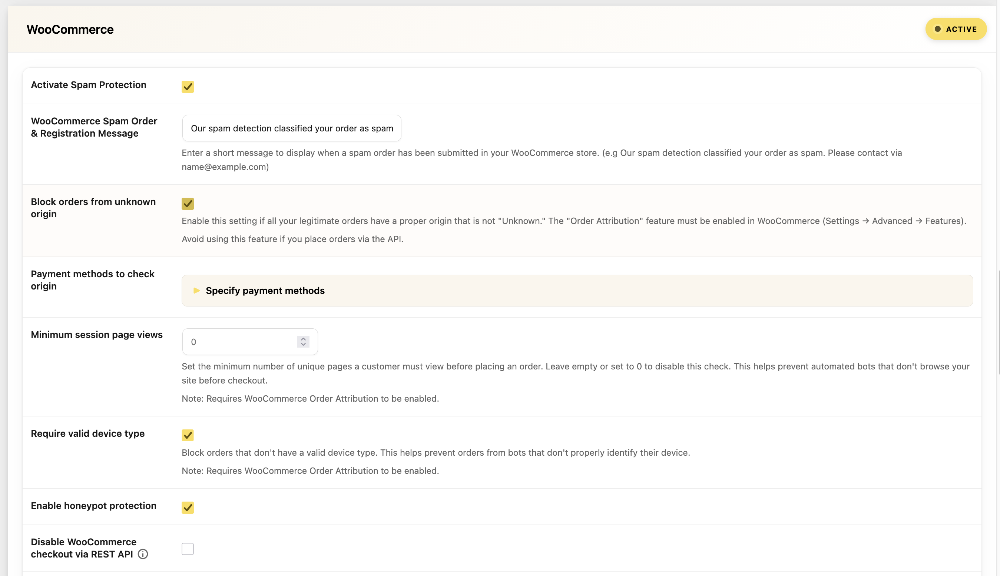
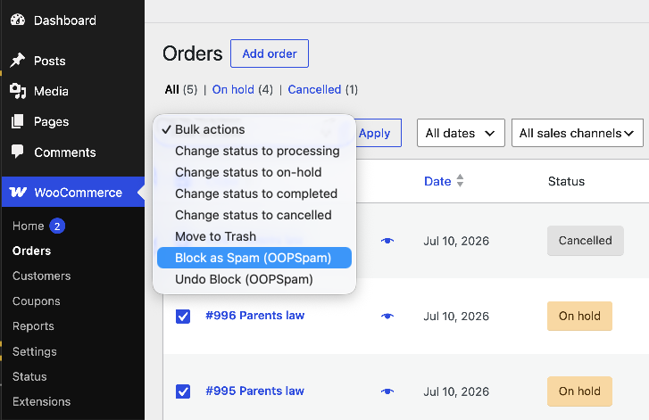

The oopspam plugin provides deep WooCommerce integration that goes beyond basic spam detection. In addition to protecting registration, login, and checkout forms with the oopspam API, it includes a comprehensive set of anti-fraud features to protect your store from automated attacks, card testing, and fraudulent orders.

For an overview of what oopspam does for stores, see [oopspam for WooCommerce](https://www.oopspam.com/woocommerce).

## Supported Forms

oopspam protects the following WooCommerce entry points:

- **Registration form** — Both standard and checkout registration
- **Login form** — Prevents automated login attempts
- **Classic checkout** — Pre- and post-order validation
- **Block-based (Store API) checkout** — Full support for WooCommerce Blocks
- **Legacy API orders** — Protection for orders created via the REST API

---

## Spam & Fraud Protection Features

### Honeypot Protection

Adds invisible hidden fields to registration, checkout billing, and login forms. Bots that auto-fill all form fields will trigger the honeypot, causing the submission to be blocked.

- **Toggle**: Enable in the WooCommerce settings section


If users with password managers or browser autofill extensions are experiencing issues, you can disable the honeypot using [the `oopspam_woo_disable_honeypot` hook](../hooks/#disable-honeypot-in-woocommerce).


---

### REST API Checkout Blocking

Prevents automated spam orders placed through the WooCommerce REST API. When enabled, blocked requests are redirected to a 404 page and logged as spam.

- **Toggle**: Enable in the WooCommerce settings section
- **Use case**: Blocks bots and scripts that bypass the browser checkout flow

---

### Order Origin Verification

When WooCommerce Order Attribution is enabled, this feature blocks orders that come from unknown or suspicious sources.

- **Toggle**: `Block orders from unknown origin`
- **Payment Method Filter**: Optionally restrict origin checking to specific payment methods only (e.g., only check orders paid via credit card)

Guide: [How to stop failed orders with unknown origin in WooCommerce](https://www.oopspam.com/blog/how-to-stop-failed-orders-with-unknown-origin-in-woocommerce)

---

### Minimum Session Page Views

Requires customers to view a minimum number of pages before placing an order. This helps block bots that go directly to checkout without browsing.

- **Setting**: `Minimum session page views`
- **Set to 0** to disable this check

---

### Device Type Validation

Blocks orders from clients that don't send a valid user agent — a strong indicator of automated scripts and bots.

- **Toggle**: `Require valid device type`

---

### Block Orders by Total Amount

Prevent fraudulent orders by blocking specific order total amounts. This is useful when you notice a pattern of test transactions at certain price points (common in card testing attacks).

- **Setting**: `Block orders with specific total amounts` — one amount per line
- **Example**: Enter `0.01`, `1.00`, `9.99` to block orders with those exact totals
- **Returning customers** with completed orders are exempt

Guide: [How to block specific order amounts in WooCommerce](https://www.oopspam.com/blog/how-to-block-specific-order-amounts-in-woocommerce)

---

### Block Orders by Billing Address

Block orders based on partial billing address matches. Useful for blocking known fraudulent addresses or suspicious patterns.

- **Setting**: `Block orders with specific billing addresses` — one address per line
- **Returning customers** with completed orders are exempt

Guide: [How to block orders by billing address in WooCommerce](https://www.oopspam.com/blog/how-to-block-orders-by-billing-address-in-woocommerce)

---

### Card Testing Prevention

Two complementary features help prevent card testing attacks on your store:

**Max Failed Payment Attempts:**
- **Setting**: `Max failed payment attempts per IP`
- **Window**: Configurable time window in hours (default: 24 hours)

**Repeated Same-Amount Orders:**
- **Setting**: `Block repeated same-amount orders`
- **Window**: Configurable time window in hours (default: 1 hour)
- **Returning customers** with completed orders are exempt

Guide: [How we blocked 450,000 card testing attempts in one week](https://www.oopspam.com/blog/the-larget-card-testing-attack)

---

## Admin Order Actions

From the WooCommerce Edit Order screen, you can manually block or unblock orders:

- **Block as Spam (oopspam)**: Reports the order to oopspam, adds the customer's email and IP to your manual moderation block lists, and marks the order as blocked
- **Undo Block (oopspam)**: Reverses the block — removes from block lists and adds to allow lists

### Bulk Actions

On the Orders list screen, you can apply these actions to multiple orders at once:

- **Block as Spam (oopspam)** — Bulk block selected orders
- **Undo Block (oopspam)** — Bulk undo block selected orders

---

## Spam Message Customization

You can customize the error message displayed to users when their order is blocked. This is configured in the WooCommerce settings section under **"WooCommerce Spam Order & Registration Message"**.

---

## Related guides

- [How to protect your store from fake orders, card testing and checkout spam](https://www.oopspam.com/blog/how-to-protect-your-store-from-fake-orders-card-testing-and-checkout-spam)
- [5 ways to stop spam orders and registrations in WooCommerce](https://www.oopspam.com/blog/spam-protection-for-woocommerce)
- [How to block VPN and data center IP traffic in your WooCommerce shop](https://www.oopspam.com/blog/how-to-block-vpn-and-data-center-ip-traffic-in-your-woocommerce-shop)
- [Best fraud detection plugins for WordPress](https://www.oopspam.com/blog/best-fraud-detection-plugins-for-wordpress-in-2026)

## Next

Explore more configuration options:






