### Quick set up

The OOPSpam WordPress plugin requires minimal configuration to function properly. Once the initial setup is complete, all management can be handled through the WordPress dashboard.

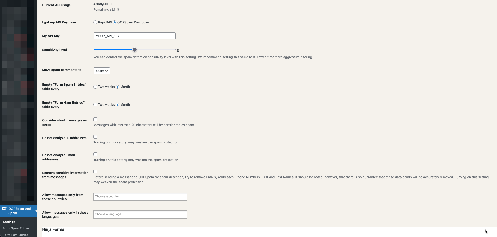

To get started quickly, follow these steps:

1. Register on the [OOPSpam Dashboard](https://app.oopspam.com/) and copy the API key.
2. Paste the key into the **"My API Key"** field in the OOPSpam WordPress Settings.
3. Select **"OOPSpam Dashboard"** from the **"I got my API Key from"** setting.
4. Ensure that the **"Activate Spam Protection"** option is checked for the contact form plugin you are using.

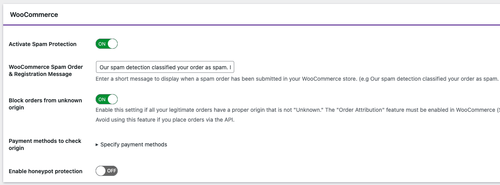



  Spam protection for comments is enabled by default.



  **The Sensitivity Level setting** controls how aggressively the plugin checks submissions for spam. The default setting is 3 (Moderate), which balances catching spam and avoiding false positives. We recommend keeping it at Moderate for most sites. Below the sensitivity slider, two experimental options are available:

  - **Reduce False Positives**: Improves detection accuracy to reduce false positives, though some spam may be missed.
  - **Extra Screening**: Applies additional checks for stricter spam filtering.

  If you believe the default setting is not a good fit for your website, please reach out to our support team for assistance.



### Form builder specific settings

When [a supported contact form builder](../#supported-contact-form-builders) is installed, the OOPSpam WordPress plugin will automatically detect it and display relevant settings. 
For example, if the plugin detects that you have installed the Elementor Page Builder, it will display specific settings for Elementor Forms.

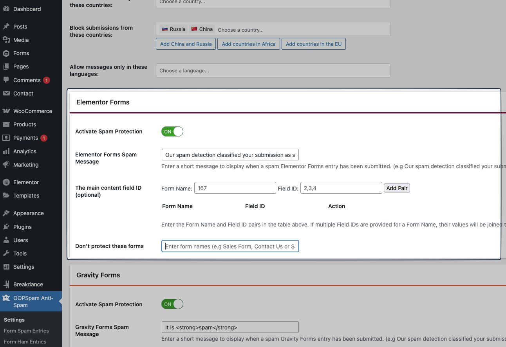

We see three settings here:

1. Activate Spam Protection
2. Elementor Form Spam Message
3. The main content field ID (optional)

Let's look at each setting in details.

**Activate Spam Protection**: Enables spam filtering for this specific contact form plugin.

**Elementor Form Spam Message**: Displays an error message when spam is detected. This can happen when legitimate users are unable to submit the form. You can use this setting to provide a custom message to guide them to an alternative way to contact you, such as through email. It also allows you to hide your actual email address and only display it to legitimate visitors.

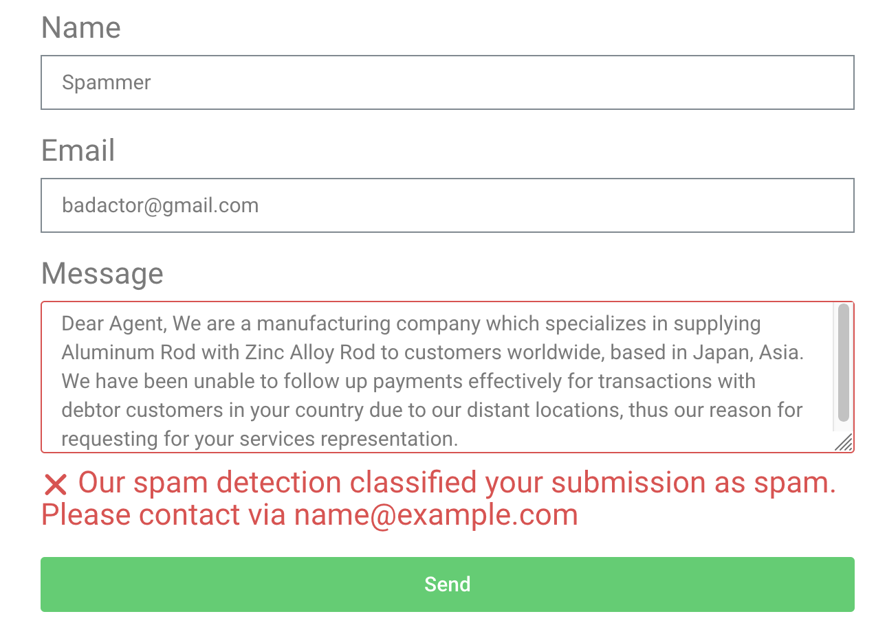

**The main content field ID (optional)**: The OOPSpam plugin detects spam not only based on IP and email, but also by analyzing the message content submitted through forms. By default, the plugin only captures the content of the first message field. If your form includes multiple message fields (textarea fields), the plugin will only analyze the first one. However, using this setting, you can specify which textarea field the OOPSpam plugin should analyze for spam.

To do so, you need to enter Field ID. It's under Advanced tab of a textarea field in your Elementor Forms.

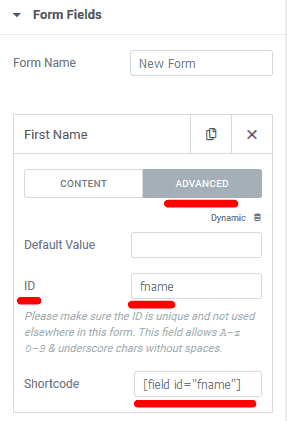

Similar to Elementor Forms, all contact form plugins have a Field ID that can be copied and pasted into this setting field, allowing the OOPSpam plugin to identify which field's content should be analyzed for spam.

### Prevent form submissions by country and language

The OOPSpam WordPress plugin offers two methods to prevent unwanted submissions, by filtering based on the country of origin and the language of the message.

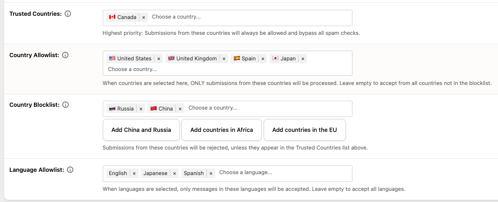

**Country Allowlist**: Only accept submissions from the selected countries. All other countries will be blocked.

**Country Blocklist**: Reject submissions from the selected countries. All other countries will be allowed.

**Language Allowlist**: If your contact form includes a message field, you can use this filter to only allow submissions written in specific languages. This is another way to limit the submissions you receive through your contact form.

### Trusted Countries

The **Trusted Countries** setting allows you to designate specific countries whose submissions will always bypass all spam checks. Unlike the country allowlist which blocks non-allowed countries, this setting lets submissions from trusted countries through without any spam analysis.

- Submissions from trusted countries skip the OOPSpam API call entirely
- Useful when you want to reduce API usage for countries you know produce only legitimate traffic
- Only available when the "Do not analyze IP addresses" privacy setting is OFF

### Contextual Detection

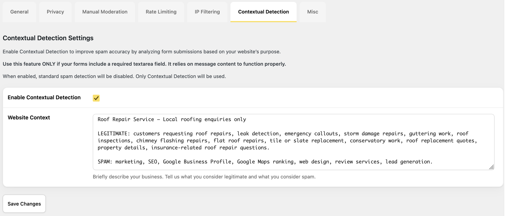

Contextual Detection uses AI to analyze form submissions based on your website's specific purpose. Instead of relying solely on generic spam patterns, it evaluates whether a submission is legitimate in the context of your business.

**Enable Contextual Detection**: When enabled, standard spam detection is disabled and only contextual analysis is used.

**Website Context**: Describe your business, what kind of messages you expect, and what you consider spam. This helps the AI understand what's legitimate for your specific use case.

Example context description for a web agency:
```
LEGITIMATE: project specs, timeline questions, design feedback, content delivery,
revision requests, hosting/domain info, meeting scheduling
SPAM: phishing links, fake invoices, crypto offers, wire transfer requests,
impersonation attempts
```


**Use this feature ONLY if your forms include a required textarea field.** Contextual Detection relies on message content to function properly.


### Manually block email, IP, keyword

The plugin automatically spam checks every form submission, registration, comment with the OOPSpam API. But sometimes you may want to quickly block email, IP address or a keyword in the message. To block manually you can use the `Manual Moderation` tab in the plugin settings.

Add the email, IP address or keyword to the appropriate field in the `Manual Moderation' tab. Add one item per line.

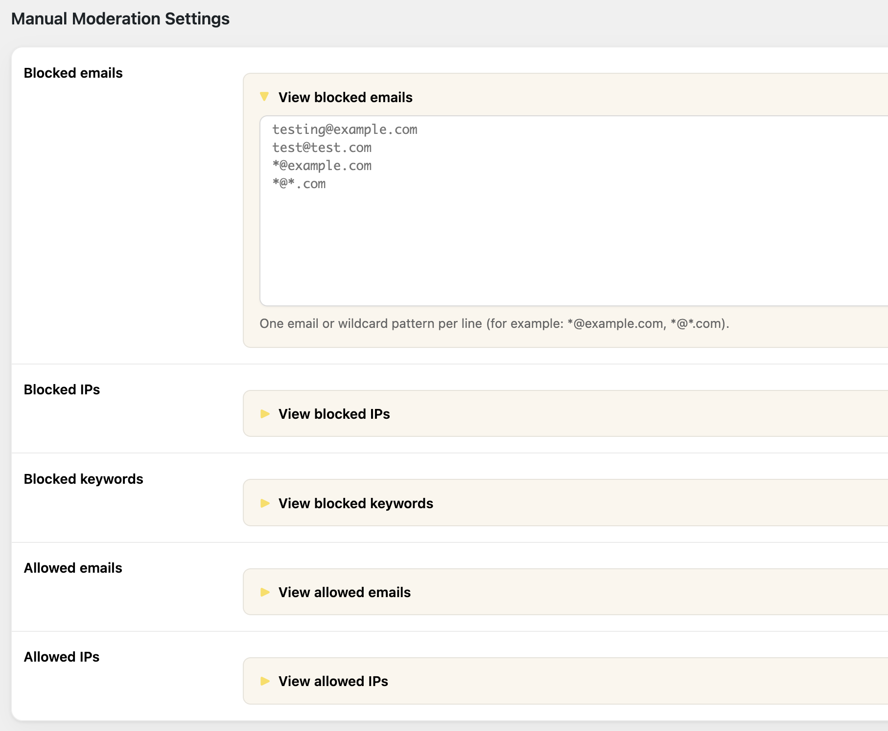

### Privacy settings

We are committed to providing our customers with the best possible privacy options. To effectively detect spam, OOPSpam only needs a minimal amount of data. When a user submits a comment or contact form, the plugin collects the user's IP address, email, and message content. It then sends this information to the OOPSpam API for spam detection.


The OOPSpam plugin does not store any personal data that is submitted through the APIs. All data is stored in your local WordPress database. 

If you encounter any false positive or false negatives, you have the option to submit them to us for review. This allows the system to improve itself based on your report and the data will be deleted within a week.


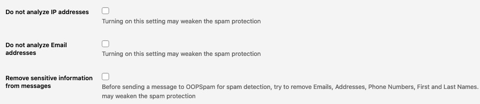

Here we have three settings:

1. **Do not analyze IP addresses**: When this setting is enabled, the plugin will not send the IP address of a submission to our servers for spam detection.

2. **Do not analyze Email addresses**: When this setting is enabled, the plugin will not send the email address of a submission to our servers for spam detection.

3. **Remove sensitive information from messages**: When this setting is enabled, the plugin will attempt to detect and remove any personal information such as email addresses, street addresses, phone numbers, and first and last names from the message. It is important to note, however, that there is no guarantee that all personal information will be accurately removed.

### IP Filtering

Control form submissions based on the origin of the IP address. These settings help prevent spam from automated systems and suspicious sources.

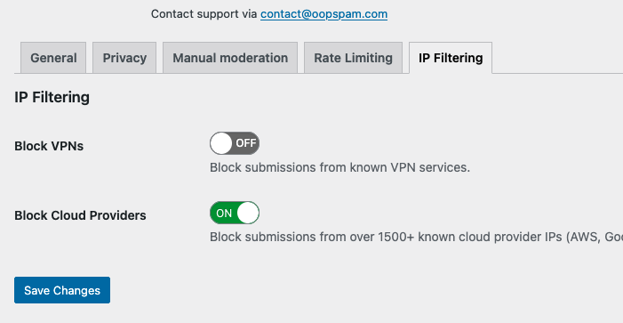

- **Block VPNs**: Enable this option to block form submissions from known VPN services. This helps prevent spam from users trying to hide their true location.

- **Block Cloud Providers**: When enabled, this setting blocks submissions from over 1,500 known cloud provider IP ranges, including AWS, Google Cloud, Azure, and others. Since legitimate users rarely submit forms from cloud infrastructure, this effectively blocks automated spam from cloud-hosted bots.

### Rate Limiting

Configure rate limits to control submission frequency and prevent spam attacks. These settings help protect your forms from automated submissions and abuse.

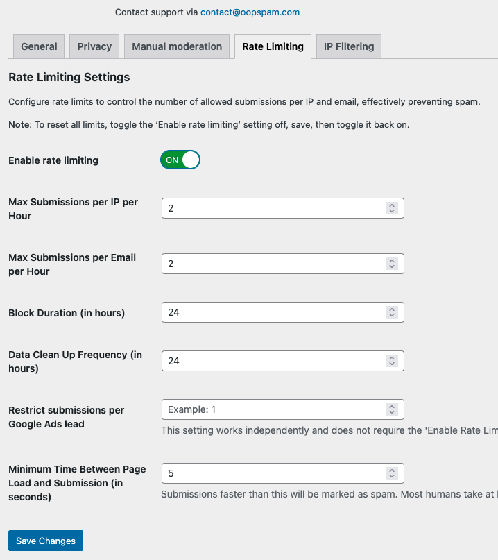

- **Enable rate limiting**: Toggle to activate or deactivate all rate limiting features
- **Max Submissions per IP per Hour**: Limit how many submissions are allowed from a single IP address within one hour
- **Max Submissions per Email per Hour**: Limit how many submissions are allowed from a single email address within one hour
- **Block Duration (in hours)**: Set how long an IP or email remains blocked after exceeding the submission limit
- **Data Clean Up Frequency (in hours)**: Set how often the rate limiting data should be cleaned up to maintain database efficiency
- **Restrict submissions per Google Ads lead**: Limit form submissions from Google Ads to prevent abuse of ad campaigns. _This setting does not require the 'Enable Rate Limiting' option to be active._

#### Submission Timing Control

This setting works independently and does not require the 'Enable Rate Limiting' option to be active:

- **Minimum Time Between Page Load and Submission (in seconds)**: Specify the minimum number of seconds that must elapse between when a page loads and when a form is submitted. Submissions made faster than this threshold will be flagged as spam. Since most human users take at least 2-3 seconds to complete a form, this setting effectively identifies automated submissions while also conserving API calls.

### Additional settings

There are additional settings that you may find useful:

- **Move spam comments to**:  By default, the OOPSpam plugin will move a spam comment to the Spam folder in [Comments](https://wordpress.org/documentation/article/comments-in-wordpress/). You can change this setting to move it to the Trash folder instead.
- **Consider short messages as spam**: Many spam messages are too short to be a meaningful sentence. This setting allows you to catch this type of spam.
- **Protect against internal search spam**: When enabled, the plugin filters WordPress internal search queries for spam patterns, preventing spam bots from abusing your site's search functionality.

The OOPSpam WordPress plugin also includes two additional menus: [Form Spam Entries and Form Valid Entries](../form-entries). These menus allow you to view and manage the submissions that the plugin has identified as spam or legitimate messages (ham).

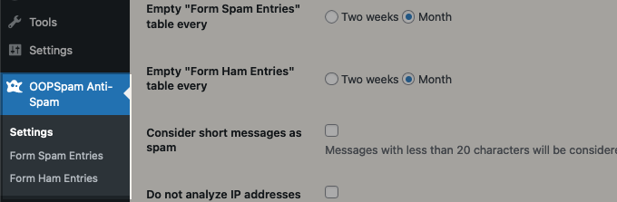
 
- **Empty "Form Spam Entries" table every**: Allows you to set an interval for automatically removing all entries in the Form Spam Entries table. This table holds all the spam submissions to your website. The default interval is set to one month.
- **Empty "Form Valid Entries" table every**: Allows you to set an interval for automatically removing all entries in the Form Valid Entries table. This table holds all the legitimate submissions (non-spam) to your website. The default interval is set to one month.



  Check [Logs](../form-entries) to learn more about these tables.


### Miscellaneous Settings

The Miscellaneous Settings section contains advanced configuration options:

**Trust proxy headers**: Enable this if your site is behind a CDN or proxy service (Cloudflare, Sucuri, etc.). This ensures the plugin detects the real visitor IP address rather than the proxy's IP. Only enable if you trust your proxy service.

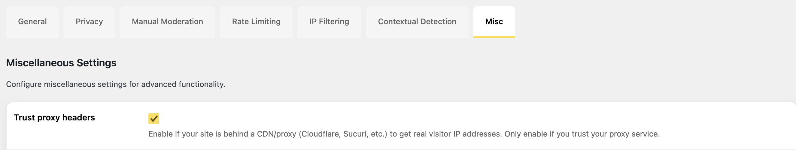

**Email admin when marked as not spam**: When enabled, the plugin sends an email notification to the admin each time a spam entry is manually marked as "not spam" (false positive). This helps you stay aware of detection accuracy.

**Entries table timezone**: Choose the timezone used to display dates in the Form Spam Entries and Form Valid Entries tables. Defaults to your WordPress site timezone, but you can select any timezone for display purposes.

### Spam Summary Report

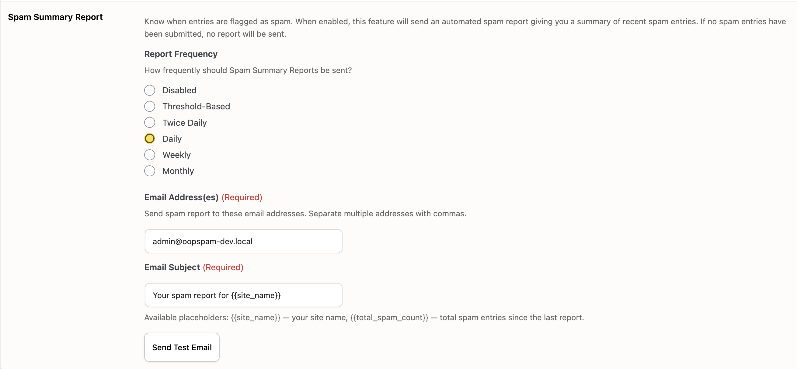

The Spam Summary Report automatically sends you email summaries of recent spam activity. This helps you stay informed about spam patterns without constantly checking the WordPress dashboard.

**Report Frequency:**
- **Disabled** - No reports are sent
- **Threshold-Based** - A report is sent once the spam entry count reaches a specified number
- **Twice Daily** - Reports sent twice per day
- **Daily** - One report per day
- **Weekly** - One report per week
- **Monthly** - One report per month

**Additional Settings:**
- **Threshold count** (Threshold-Based mode): Number of spam entries that triggers a report
- **Recipient emails**: Comma-separated list of email addresses to receive reports (defaults to admin email)
- **Custom subject line**: Customize the email subject using `{{site_name}}` as a placeholder for your site name


If no spam entries have been recorded since the last report, no report will be sent.


### Manual Moderation Details


The Manual Moderation tab supports advanced matching patterns:

**Email Blocking:** Supports exact match and wildcard patterns.
- `spammer@example.com` - blocks a specific email
- `*@example.com` - blocks all emails from a domain
- `*@*.ru` - blocks all emails from a TLD

**IP Blocking:** Supports individual IPs, CIDR notation, and IP ranges.
- `192.168.1.1` - blocks a specific IP
- `192.168.1.0/24` - blocks an entire subnet (CIDR)
- `192.168.1.1-192.168.1.10` - blocks an IP range

**Keyword Blocking:** Blocks submissions containing specific words or phrases regardless of capitalization.

**Priority Order:** Checks are performed in this order before the API call:
1. Blocked emails → block immediately
2. Blocked IPs → block immediately
3. Allowed emails → allow immediately (bypass API)
4. Allowed IPs → allow immediately (bypass API)
5. Blocked keywords → block immediately
