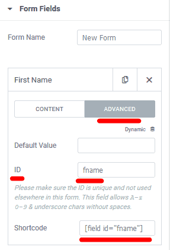

### Quick set up

The OOPSpam WordPress plugin requires minimal configuration to function properly. Once the initial setup is complete, all management can be handled through the WordPress dashboard.

To get started quickly, follow these steps:

1. Register on the [OOPSpam Dashboard](https://app.oopspam.com/) and copy the API key.
2. Paste the key into the "My API Key" field in the OOPSpam WordPress Settings.
3. Select "OOPSpam Dashboard" from the "I got my API Key from" setting.
4. Ensure that the "Activate Spam Protection" option is checked for the contact form plugin you are using.


  Spam protection for comments is enabled by default.



  **The Sensitivity Level setting** in the OOPSpam plugin controls how aggressively the plugin checks submissions for spam. The default setting is 3, which is a balance between catching spam and avoiding false positives (legitimate submissions marked as spam). **We recommend leaving the Sensitivity Level setting at 3, as this will provide the best overall performance**. However, if you believe that the default setting is not a good fit for your website, please reach out to our support team for assistance.


### Contact form specific settings

When [a supported contact form builder](../#supported-contact-form-builders) is installed, the OOPSpam WordPress plugin will automatically detect it and display relevant settings. 
For example, if the plugin detects that you have installed the Elementor Page Builder, it will display specific settings for Elementor Forms.

We see three settings here:

1. Activate Spam Protection
2. Elementor Form Spam Message
3. The main content field ID (optional)

Let's look at each setting in details.

**Activate Spam Protection**: Enables spam filtering for this specific contact form plugin.

**Elementor Form Spam Message**: Displays an error message when spam is detected. This can happen when legitimate users are unable to submit the form. You can use this setting to provide a custom message to guide them to an alternative way to contact you, such as through email. It also allows you to hide your actual email address and only display it to legitimate visitors.

**The main content field ID (optional)**: The OOPSpam plugin detects spam not only based on IP and email, but also by analyzing the message content submitted through forms. By default, the plugin only captures the content of the first message field. If your form includes multiple message fields (textarea fields), the plugin will only analyze the first one. However, using this setting, you can specify which textarea field the OOPSpam plugin should analyze for spam.

To do so, you need to enter Field ID. It's under Advanced tab of a textarea field in your Elementor Forms.

Similar to Elementor Forms, all contact form plugins have a Field ID that can be copied and pasted into this setting field, allowing the OOPSpam plugin to identify which field's content should be analyzed for spam.

### Prevent form submissions by country and language

The OOPSpam WordPress plugin offers two methods to prevent unwanted submissions, by filtering based on the country of origin and the language of the message.

**Allow messages only from these countries**: This setting allows you to specify which countries you want to allow submissions from. By adding countries here, you can quickly limit submissions to only those countries, while still keeping your website accessible worldwide.

**Block messages from these countries**: This setting allows you to specify which countries you want to block submissions from.

**Allow messages only in these languages**: If your contact form includes a message field, you can use this filter to only allow submissions written in specific languages. This is another way to limit the submissions you receive through your contact form.

### Manually block email, IP, keyword

The plugin automatically spam checks every form submission, registration, comment with the OOPSpam API. But sometimes you may want to quickly block email, IP address or a keyword in the message. To block manually you can use the `Manual Moderation` tab in the plugin settings.

Add the email, IP address or keyword to the appropriate field in the `Manual Moderation' tab. Add one item per line.

### Privacy settings

We are committed to providing our customers with the best possible privacy options. To effectively detect spam, OOPSpam only needs a minimal amount of data. When a user submits a comment or contact form, the plugin collects the user's IP address, email, and message content. It then sends this information to the OOPSpam API for spam detection.


The OOPSpam plugin does not store any personal data that is submitted through the APIs. All data is stored in your local WordPress database. If you encounter any false positive or false negatives, you have the option to submit them to us for review. This allows the system to improve itself based on your report and the data will be deleted within a week.


Here we have three settings:

**Do not analyze IP addresses**: When this setting is enabled, the plugin will not send the IP address of a submission to our servers for spam detection.

**Do not analyze Email addresses**: When this setting is enabled, the plugin will not send the email address of a submission to our servers for spam detection.

**Remove sensitive information from messages**: When this setting is enabled, the plugin will attempt to detect and remove any personal information such as email addresses, street addresses, phone numbers, and first and last names from the message. It is important to note, however, that there is no guarantee that all personal information will be accurately removed.

### Additional settings

There are additional settings that you may find useful:

- **Move spam comments to**:  By default, the OOPSpam plugin will move a spam comment to the Spam folder in [Comments](https://wordpress.org/documentation/article/comments-in-wordpress/). You can change this setting to move it to the Trash folder instead.
- **Consider short messages as spam**: Many spam messages are too short to be a meaningful sentence. This setting allows you to catch this type of spam.

The OOPSpam WordPress plugin also includes two additional menus: [Form Spam Entries and Form Ham Entries](../form-entries). These menus allow you to view and manage the submissions that the plugin has identified as spam or legitimate messages (ham).

 
- **Empty "Form Spam Entries" table every**: Allows you to set an interval for automatically removing all entries in the Form Spam Entries table. This table holds all the spam submissions to your website. The default interval is set to one month.
- **Empty "Form Ham Entries" table every**: Allows you to set an interval for automatically removing all entries in the Form Ham Entries table. This table holds all the legitimate submissions (non-spam) to your website. The default interval is set to one month.


  Check [Form Spam Entries and Form Ham Entries page](../form-entries) to learn more about these tables.

