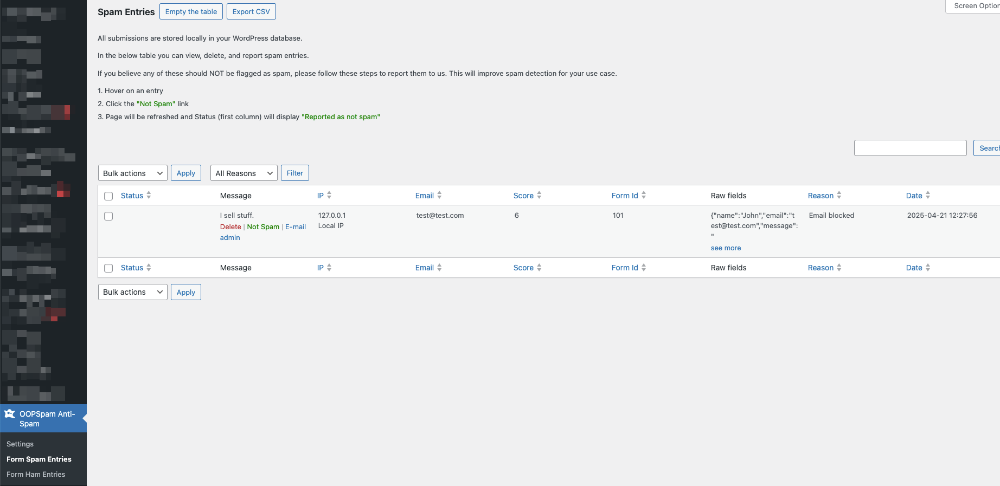
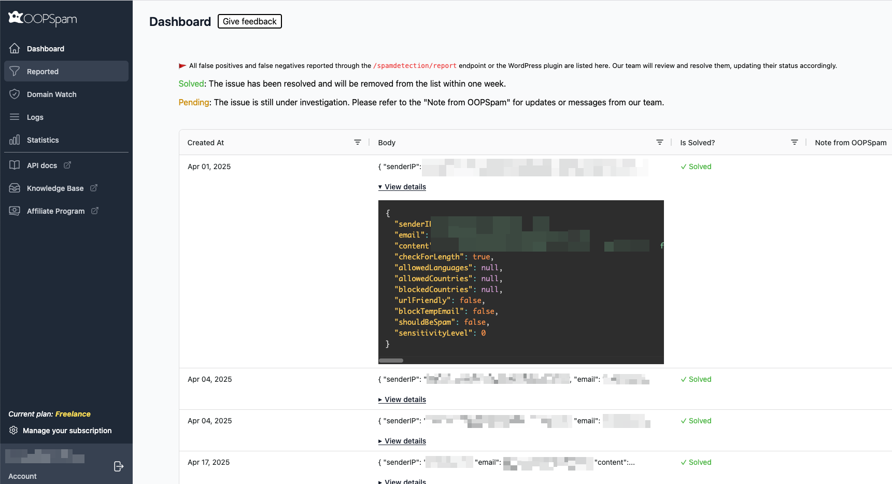

When you enable spam protection for your contact forms, every submission will be stored in one of two places: the Form Ham Entries or the Form Spam Entries.

- **The Form Ham Entries** table stores all submissions that were not detected as spam.
- **The Form Spam Entries** table stores all submissions that were detected as spam.

You can use these tables to review and report any misdetected entries to us, which will help OOPSpam improve its spam detection capabilities and better meet the specific needs of your website.

To report a falsely flagged entry to OOPSpam:

1. Go to the Form Spam Entries or Form Ham Entries table in the OOPSpam plugin settings in your WordPress dashboard.
2. Hover over the entry you want to report.
3. Click on the "Not Spam" link for a submission that was incorrectly marked as spam, or the "Spam" link for a submission that was incorrectly marked as legitimate.
4. The page will refresh, and the status of the entry will update to "Reported as not spam" or "Reported as spam".

By default, both the Form Ham Entries and Form Spam Entries tables will be emptied automatically once every month. This helps keep the size of the tables manageable and does not affect the performance of the OOPSpam plugin or the accuracy of the spam detection.

You can change the interval at which the tables are cleared by using the [**Empty “Form Spam Entries” table every** and **Empty “Form Ham Entries” table every** settings](../configuration/#additional-settings) in the OOPSpam plugin settings in your WordPress dashboard.

You can also view these reported entries on [the OOPSpam Dashboard under the "Reported" section](https://app.oopspam.com/ReportedSpam). This allows you to easily track and review all reported entries, and help OOPSpam improve its spam detection algorithms.

Entries that are reported and reviewed in the OOPSpam Dashboard will be removed within a week once they are resolved.

