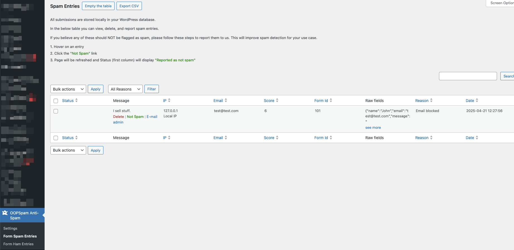
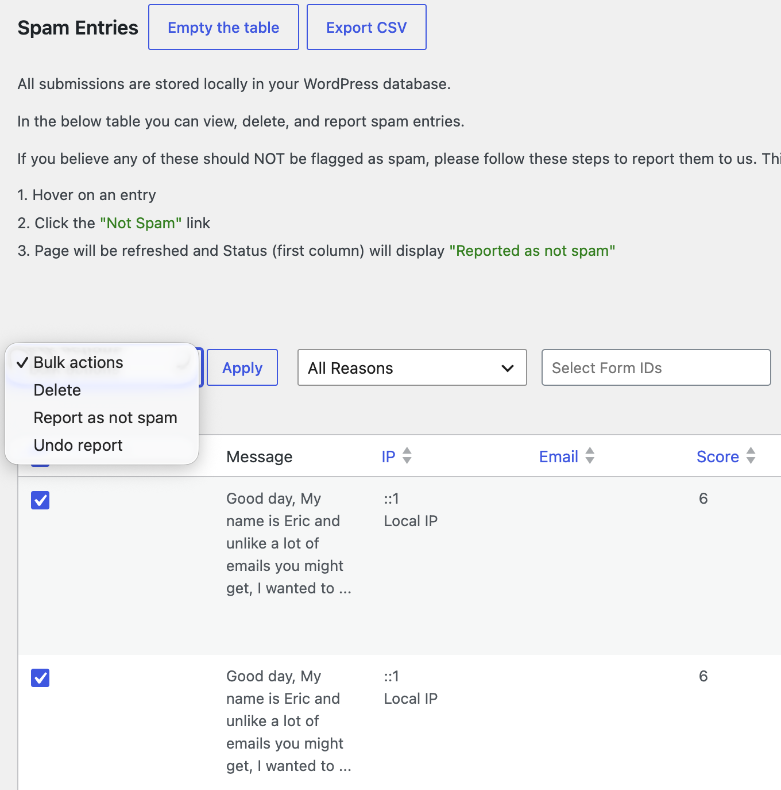
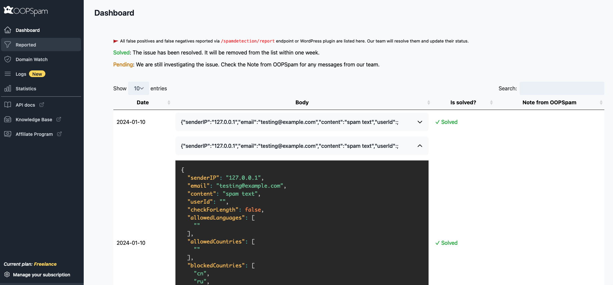
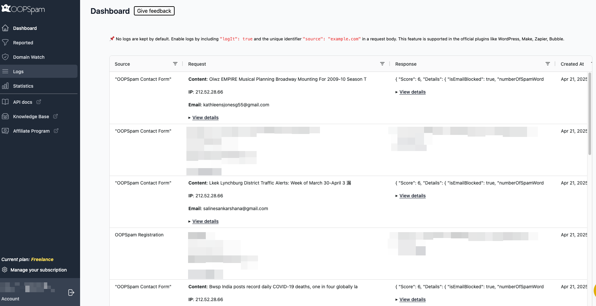

## Logs in the WordPress Dashboard

When you enable spam protection for your contact forms, every submission will be stored in one of two places: the Form Valid Entries or the Form Spam Entries.

- **The Form Valid Entries** table stores all submissions that were not detected as spam.
- **The Form Spam Entries** table stores all submissions that were detected as spam.

You can use these tables to review and report any misdetected entries to us, which will help OOPSpam improve its spam detection capabilities and better meet the specific needs of your website.

To report a falsely flagged entry to OOPSpam:

1. Go to the Form Spam Entries or Form Valid Entries table in the OOPSpam plugin settings in your WordPress dashboard.
2. Hover over the entry you want to report.
3. Click on the "Not Spam" link for a submission that was incorrectly marked as spam, or the "Spam" link for a submission that was incorrectly marked as legitimate.
4. The page will refresh, and the status of the entry will update to "Reported as not spam" or "Reported as spam".

### Bulk Actions

Both the Form Spam Entries and Form Valid Entries tables support bulk operations on multiple entries at once:

- **Delete** - Remove multiple entries simultaneously
- **Report as Not Spam / Report as Spam** - Report multiple entries to OOPSpam for improved detection accuracy
- **Undo Report** - Reverse a previous report action

Bulk reporting is processed asynchronously, so you can continue working while reports are submitted in the background.

### Export to CSV

You can export your spam and ham entries to a CSV file for external analysis or record keeping. The export excludes internal IDs and report status columns, and dates are formatted according to your configured [entries table timezone setting](../configuration/#miscellaneous-settings).

To export, use the **"Export to CSV"** button available on both the Form Spam Entries and Form Valid Entries pages.

### Auto-Cleanup Scheduling

By default, both the Form Valid Entries and Form Spam Entries tables will be emptied automatically once every month. This helps keep the size of the tables manageable and does not affect the performance of the OOPSpam plugin or the accuracy of the spam detection.

You can change the interval at which the tables are cleared by using the [**Empty "Form Spam Entries" table every** and **Empty "Form Valid Entries" table every** settings](../configuration/#additional-settings) in the OOPSpam plugin settings in your WordPress dashboard. Available intervals are **Monthly** and **Bi-weekly**.

## Logs in the OOPSpam Dashboard 

You can also view these reported entries on [the OOPSpam Dashboard under the "Reported" section](https://app.oopspam.com/ReportedSpam). This allows you to easily track and review all reported entries, and help OOPSpam improve its spam detection algorithms.

Entries that are reported and reviewed in the OOPSpam Dashboard will be removed within a week once they are resolved.

